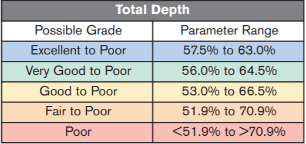

```{r load packages and data, echo=FALSE, warning=FALSE, message=FALSE}
library(tidyverse)
library(kableExtra)

load("Data/updated_diamonds.Rda")
load("Data/ridge_fit1_rs.Rda")
load("Data/ridge_fit2_rs.Rda")
load("Data/ridge_fit3_rs.Rda")
load("Data/glmnet_fit1_rs.Rda")
load("Data/glmnet_fit2_rs.Rda")
load("Data/glmnet_fit3_rs.Rda")
load("Data/tree_fit_tune.Rda")
load("Data/rf_fit_tune.Rda")
load("Data/rf_fit_tune_fine.Rda")
load("Data/y11_idsdiamonds.Rda")
load("Data/zhigh_idsdiamonds.Rda")
load("Data/rec_calc_total_depth.Rda")
load("Data/largediff_depth.Rda")
```

# Introduction

Round cut diamonds (also called round brilliant) are the most popular shape of diamond and are often used in jewelery such as engagement rings. The 


# About the Data

The Diamonds data set was originally procured by requesting the data set from Dr. Crawford at Texas A&M. Upon further inspection, it was realized that this data set was a common data set used for learning how to make exploratory graphics and perform rudimentary inference. This data set comes standard in the ggplot2 package and includes a desciption of the data that we have reproduced in table 1. 

The Diamonds data set contains the the characteristics of 53,940 round cut diamonds. The variables associated with each diamond are as follows: price (in US Dollars), carat (weight), Cut (Fair, Good, Very Good, Premium, Ideal), Color (D (best) to J (worst)), Clarity (I1 (worst), SI2, SI1, VS2, VS1, VVS2, VVS1, IF (best), x (length in mm), y (width in mm), z (depth in mm), depth (total depth percentage), and table (total table percentage). Cut, color, and clarity were ordered categorical variables as described in table 1 while the rest were numerical variables. Based on the data description and the use of the Diamonds data set in other reports, the data was believed to contain independent observations and the methods used in this report treated each observation as independent of one another. 

```{r Diamonds description table, echo=FALSE}
ddf <- data.frame("Variable" = c("price", "carat", "cut", "color", "clarity", "x", "y", "z", "depth", "table"),
                  "Description" = c("Price in US dollars ($326–$18,823)",
                                    "Weight of the diamond (0.2–5.01)",
                                    "Quality of the cut (Fair, Good, Very Good, Premium, Ideal)",
                                    "Diamond colour, from D (best) to J (worst)",
                                    "A measurement of how clear the diamond is (I1 (worst), SI2, SI1, VS2, VS1, VVS2, VVS1, IF (best))",
                                    "Length in mm (0–10.74)",
                                    "Width in mm (0–58.9)",
                                    "Depth in mm (0–31.8)",
                                    "Total depth percentage = z / mean(x, y) = 2 * z / (x + y) (43–79)",
                                    "Width of top of diamond relative to widest point (43–95)"))

ddf %>%
  kable(format = "latex", align = "c",
        caption = "Description of the Diamonds data set from the ggplot2 package.")
```

The statistical programming language R was used within Rstudio along with the following packages: tidyverse, GGally, tidymodels, doParallel, parallel, and vip. 

## Missing values and Outliers

The data initially had no missing values, but upon further inspection it was found that there were 20 rows where either the x, y, or z measurement had a value of zero. These zero values were replaced with missing values (NA in R) as it would not be possible for a round cut diamond to have zero length, width, or depth. 12 of these rows only contained one variable with a missing value: the z variable. Because total depth percentage, x, and y were not missing and the total depth percentage by definition was a calculation using x, y, and z, we thought it was appropriate to replace these 12 missing z values using the following formula derived from the total depth percentage calculation:
$$z=\frac{depth\%*(x+y)}{2*100}$$

The calculated z value was rounded to the second decimal place to match the format of the other z values in the data set. 

Additionally, two observations were found where y (width in mm) was abnormally larger than x (length in mm). Since round cut diamonds are cut diamonds where x and y are supposed to be relatively close to each other, it is highly unlikely that y would be six to seven times greater than x as seen in table 2. Also, the depth (z) of the diamond tends to be smaller than the average of x and y and round cut diamonds having greater than 100% depth percentage seems extremely unlikely as a round cut diamond is considered poor once its depth percentage is greater than 70.9% (Figure 1).



```{r abnormally large ys, echo=FALSE}
y11_idsdiamonds %>%
  kable(format = "latex", align = "c",
        caption = "Abnormally large values of y in the Diamonds data set.")
```

Likewise, using GIA's $Facetware^{(R)}$ which compares proportions of round cut diamonds to 38.5 million proportion sets, the highest total depth percentage we were able to acheive was 83.8%. Examining table 2 further, we also saw that the z value was extremely close in value to x. Based on this information it was decided that the z values in table 2 were actually supposed to be the y values. These two observations were corrected by replacing the y values with the given z values and calculating new z values using the same formula as before.

Two other observations were found where the depth (z) was greater than the average of x and y (table 3). These observations were also corrected so using the same z formula as before.
```{r zhigh diamonds, echo=FALSE}
zhigh_idsdiamonds %>%
  kable(format = "latex", align = "c",
        caption = "Diamonds where depth (z) is greater than the average diameter.")
```

To find additional discrepancies in the data, the total depth percentage was calculated for all other observations using the formula in table 1. There were obvious differences between the calculated and recorded total depth percentages as seen in figure 2. It was found that there were 120 observations with a 1% difference or more between the recorded and calculated total depth percentage. Going further, there were 18 observations with a 10% difference or more between the recorded and calculated total depth percentage. The x and y features of these 18 observations noticeably similar with x ranging from 0.75 t0 1.62 times the size of y. The z values were again suspected to be the reason for the noticeable difference between the recorded and calculated total depth percentages for these 18 observations. The z values were thus replaced using the same formula as before. To avoid possibly biasing the data, any remaining observations that had a difference between the recorded and calculated total depth percentage were left as is. 

```{r recorded vs. calculated total depth, echo=FALSE, fig.cap="Recorded vs. Calcualted Total Depth Percentage", fig.height=4, fig.width=6}
rec_calc_total_depth
```


## Examing the cleaned data

