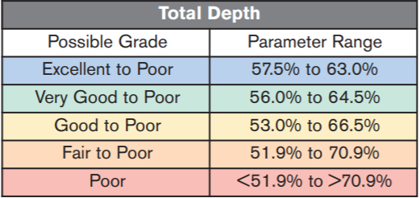
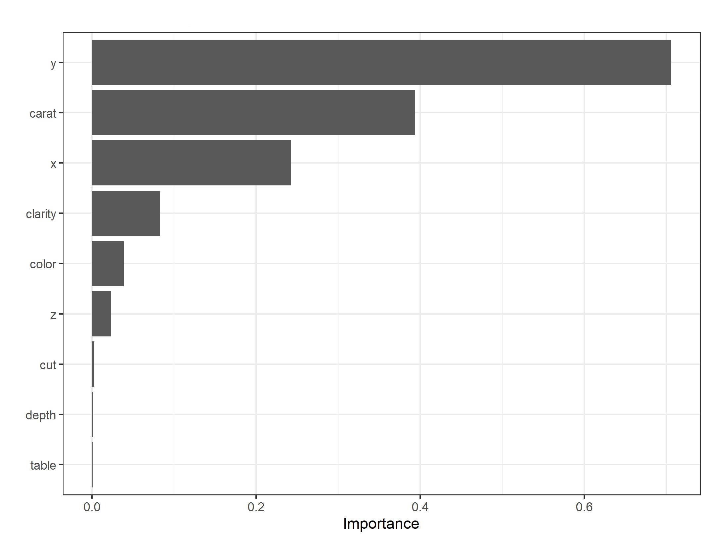

```{r set chunk parameters, echo=FALSE}
knitr::opts_chunk$set(echo = FALSE, warning = FALSE, message = FALSE)
```


```{r load packages and data, echo=FALSE, warning=FALSE, message=FALSE}
library(tidyverse)
library(tidymodels)
library(kableExtra)
library(patchwork)
library(GGally)
library(magick)

load("Data/updated_diamonds.Rda")
load("Data/ridge_fit1_rs.Rda")
load("Data/ridge_fit2_rs.Rda")
load("Data/ridge_fit3_rs.Rda")
load("Data/ridge_fit4_rs.Rda")
load("Data/ridge_fit5_rs.Rda")
load("Data/ridge_fit6_rs.Rda")
load("Data/ridge_fit7_rs.Rda")
load("Data/glmnet_fit1_rs.Rda")
load("Data/glmnet_fit2_rs.Rda")
load("Data/glmnet_fit3_rs.Rda")
load("Data/glmnet_fit4_rs.Rda")
load("Data/glmnet_fit5_rs.Rda")
load("Data/glmnet_fit6_rs.Rda")
load("Data/glmnet_fit7_rs.Rda")
load("Data/tree_fit_tune.Rda")
load("Data/rf_fit_tune.Rda")
load("Data/rf_fit_tune_fine.Rda")
load("Data/y11_idsdiamonds.Rda")
load("Data/zhigh_idsdiamonds.Rda")
load("Data/rec_calc_total_depth.Rda")
load("Data/largediff_depth.Rda")
load("Data/data_split.Rda")
load("Data/train_data.Rda")
load("Data/test_data.Rda")
load("Data/preds_price.Rda")
```

# Introduction

For centuries diamonds have been sought after as symbols of wealth and prosperity. They have been adorned on the crowns of royals and in the past century used as a symbol of a couple's eternal love. In the eyes of the public they are a valuable commodity with the worldwide retail market for diamond jewelry having an estimated worth of $60 billion dollars in 2010 (cnbc). Round cut diamonds (also called round brilliant diamonds) are the most popular shape of diamond and are often used in jewelery such as engagement rings. This style of diamond has been around since the 1700s and the techniques used to make this style of diamond have been modified over the years to produce more brilliant and outstanding diamonds (GIA).


# Methods

## About the Data

The Diamonds data set was originally procured by requesting the data set from Dr. Crawford at Texas A&M. Upon further inspection, it was realized that this data set was a common data set used for learning how to make exploratory graphics and perform rudimentary inference. This data set comes standard in the ggplot2 package and includes a desciption of the data that we have reproduced in table 1. 

The Diamonds data set contains the the characteristics of 53,940 round cut diamonds. The variables associated with each diamond are as follows: price (in US Dollars), carat (weight), Cut (Fair, Good, Very Good, Premium, Ideal), Color (D (best) to J (worst)), Clarity (I1 (worst), SI2, SI1, VS2, VS1, VVS2, VVS1, IF (best), x (length in mm), y (width in mm), z (depth in mm), depth (total depth percentage), and table (total table percentage). Cut, color, and clarity were ordered categorical variables as described in table 1 while the rest were numerical variables. Based on the data description and the use of the Diamonds data set in other reports, the data was believed to contain independent observations and the methods used in this report treated each observation as independent of one another. 

```{r Diamonds description table, echo=FALSE}
ddf <- data.frame("Variable" = c("price", "carat", "cut", "color", "clarity", "x", "y", "z", "depth", "table"),
                  "Description" = c("Price in US dollars ($326–$18,823)",
                                    "Weight of the diamond (0.2–5.01)",
                                    "Quality of the cut (Fair, Good, Very Good, Premium, Ideal)",
                                    "Diamond colour, from D (best) to J (worst)",
                                    "A measurement of how clear the diamond is (I1 (worst), SI2, SI1, VS2, VS1, VVS2, VVS1, IF (best))",
                                    "Length in mm (0–10.74)",
                                    "Width in mm (0–58.9)",
                                    "Depth in mm (0–31.8)",
                                    "Total depth percentage = z / mean(x, y) = 2 * z / (x + y) (43–79)",
                                    "Width of top of diamond relative to widest point (43–95)"))

ddf %>%
  kable(format = "latex", align = "c",
        caption = "Description of the Diamonds data set from the ggplot2 package.")
```


There exists two primary graders of diamonds: the Gemological Institute of America (GIA) and the American Gem Society (AGS). Both use the 4Cs to characterize a faceted diamond:color, clarity, cut, and carat weight. Both have similar grading scales for color and clarity, and only slightly differ on the grading for cut. The GIA is used as the main reference for the remainder of this report.

```{r GIA color image, echo=FALSE, out.extra='trim={0 4.5cm 0 4cm},clip', fig.cap="GIA color scale."}
GIAcolor <- image_read("Figures/GIA_color_scale.jpg")
plot(GIAcolor)

```

The GIA scale for the color of a diamond ranges from the top grade "D" (colorless) to the worst grade "Z" (light yellow) (Figure 1). The diamonds in the data set used only ranged from "D" to "J" meaning that that there may be diamonds with a worse color than the ones in this data set such that the predictive model created would not yield accurrate predictions. 

```{r GIA clarity image, echo=FALSE, out.extra='trim={0 4.5cm 0 4cm},clip', fig.cap="GIA clarity scale."}
GIAclarity <- image_read("Figures/GIA_clarity_scale.jpg")
plot(GIAclarity)

```

The clarity scale that the GIA grades a faceted diamond ranges from the best grade Flawless to the worst grade I3 (figure 2). Inclusions are imperfections usually caused by the heat and pressure that become apparent with the use of a microscope. An example would be a mineral crystal within the diamond itself or even a break in the gemstone. The Diamonds data set only contained diamonds with a clarity that ranged from Internally Flawless (IF) to the first level of Included (I1) so again there may be diamonds with a clarity of Flawless, I2, or I3 for which the predictive model created would not yield accurate predictions.

```{r GIA cut image, echo=FALSE, out.extra='trim={0 5cm 0 4cm},clip', fig.cap="GIA cut scale."}
GIAcut <- image_read("Figures/GIA_cut_scale.jpg")
plot(GIAcut)

```

The GIA scale for the cut of a diamond depends on how the diamond interacts with light and ranges from the best grade Excellent to the worst grade Poor. The cut of the diamonds in the data set ranged from the best grade Ideal to the worst grade Fair. Both scales slightly differ, but each contains five levels. It is unsure if each level directly translates to one another. It may be that the diamond is graded using a variation of the American Gem Society scale as seen in figure ?; however, the scale in the diamonds data set still differs slightly. Further investigation may be needed before using the predictive model on diamonds using either the GIA or AGS cut scale.


```{r AGS cut scale, echo=FALSE, out.extra='trim={0 4.5cm 0 4cm},clip', fig.cap="AGS cut scale."}
AGScut <- image_read("Figures/AGS_cut_scale.png")
plot(AGScut)

```


Figure ? illustrates the anatomy of a typical cut diamond. The top horizontal facet of a diamond is called the table and the table size as used in the data set is the percentage of the length of this facet compared to the average of x and y (the average girdle diameter). The total depth as used in the data set is the percentage of the overall depth relative to the average girdle diameter.


```{r GIA diamond anatomy image, echo=FALSE, out.extra='trim={0 3.2cm 0 3.5cm},clip', fig.cap="GIA anatomy of a diamond."}
GIAanatomy <- image_read("Figures/GIA_anatomy_of_diamond.jpg")
plot(GIAanatomy)

```

The data was analyzed and predictve model was built using the statistical programming language R within Rstudio along with the following packages: tidyverse, GGally, tidymodels, doParallel, parallel, and vip. 

## Missing values and Outliers

The data initially had no missing values, but upon further inspection it was found that there were 20 rows where either the x, y, or z measurement had a value of zero. These zero values were replaced with missing values (NA in R) as it would not be possible for a round cut diamond to have zero length, width, or depth. 12 of these rows only contained one variable with a missing value: the z variable. Because total depth percentage, x, and y were not missing and the total depth percentage by definition was a calculation using x, y, and z, we thought it was appropriate to replace these 12 missing z values using the following formula derived from the total depth percentage calculation:
$$z=\frac{depth\%*(x+y)}{2*100}$$

The calculated z value was rounded to the second decimal place to match the format of the other z values in the data set. 

Additionally, two observations were found where y (width in mm) was abnormally larger than x (length in mm). Since round cut diamonds are cut diamonds where x and y are supposed to be relatively close to each other, it is highly unlikely that y would be six to seven times greater than x as seen in table 2. Also, the depth (z) of the diamond tends to be smaller than the average of x and y and round cut diamonds having greater than 100% depth percentage seems extremely unlikely as a round cut diamond is considered poor once its depth percentage is greater than 70.9% (Figure 1).



```{r abnormally large ys, echo=FALSE}
y11_idsdiamonds %>%
  kable(format = "latex", align = "c",
        caption = "Abnormally large values of y in the Diamonds data set.")
```

Likewise, using GIA's $Facetware^{(R)}$ which compares proportions of round cut diamonds to 38.5 million proportion sets, the highest total depth percentage we were able to acheive using a given set of parameters was 83.8% with a typical error of 0.2% - 0.3%. Examining table 2 further, we also saw that the z value was extremely close in value to x. Based on this information it was decided that the z values in table 2 were actually supposed to be the y values. These two observations were corrected by replacing the y values with the given z values and calculating new z values using the same formula as before.

Two other observations were found where the depth (z) was greater than the average of x and y (table 3). These observations were also corrected so using the same z formula as before.
```{r zhigh diamonds, echo=FALSE}
zhigh_idsdiamonds %>%
  kable(format = "latex", align = "c",
        caption = "Diamonds where depth (z) is greater than the average diameter.")
```

To find additional discrepancies in the data, the total depth percentage was calculated for all other observations using the formula in table 1. There were obvious differences between the calculated and recorded total depth percentages as seen in figure 2. It was found that there were 120 observations with a 1% difference or more between the recorded and calculated total depth percentage. Going further, there were 18 observations with a 10% difference or more between the recorded and calculated total depth percentage. The x and y features of these 18 observations noticeably similar with x ranging from 0.75 t0 1.62 times the size of y. The z values were again suspected to be the reason for the noticeable difference between the recorded and calculated total depth percentages for these 18 observations. The z values were thus replaced using the same formula as before. To avoid possibly biasing the data, any remaining observations that had a difference between the recorded and calculated total depth percentage were left as is. 

```{r recorded vs calculated depth, echo=FALSE, fig.cap="Comparison of the recorded and calculated total depth percentage."}
rec_calc_total_depth %>%
  drop_na() %>%
  ggally_points(aes(x = temp_depth, y = depth)) +
  geom_abline(aes(slope = 1, intercept = 0, color = "red"), linetype = "dashed") +
  xlab("Calculated Total Depth Percentage") +
  ylab("Recorded Total Depth Percentage") +
  scale_color_manual(name = "Ratio", values = c("red" = "red"), labels = "1:1") +
  scale_x_continuous(labels = scales::label_percent(accuracy = 1, scale = 1)) +
  scale_y_continuous(labels = scales::label_percent(accuracy = 1, scale = 1))+
  theme_bw() 
```


After cleaning the data, only eight observations in total remained that contained missing values. Seven of the observations had missing values in x, y, and, z, while the last observation had only missing values in x and z. It was decided to keep these observations instead of deleting them in order to retain as much data as possible. A bagged tree imputation method with 25 trees was implemented programatically using the step_impute_bag() function in the recipes package. This method was chosen as a tree can be constructed in the presence of other missing data, trees generally have good accuracy, and they do not extrapolate outside the bounds of the training data. Bagged tree imputation methods also provide reasonable values with a lower computational cost than random forest imputation methods (Kuhn feature engineering). The method was implemented in such a way to avoid data leakage e.g. the preprocessing was done within each fold of the 10-fold cross validation.

# Examining the Cleaned Data

The response variable for the Diamonds data set was decided to be the price in US dollars for each diamond. 
```{r price and log price, echo=FALSE}
a <- diamonds %>%
  ggplot(aes(x = price)) +
  geom_density(size = 1.05, fill = "steelblue", alpha = 0.8) +
  xlab("Price (US Dollars)") +
  ylab("Density") +
  geom_vline(aes(xintercept = mean(price), color = "Mean"), linetype = "dashed") +
  geom_vline(aes(xintercept = quantile(price, 0.5), color = "Median"), linetype = "twodash") +
  scale_x_continuous(labels = scales::label_dollar()) +
  scale_color_manual(name = "", values = c(Mean = "deeppink1", Median = "darkorchid1")) +
  theme_minimal()

b <- diamonds %>%
  ggplot(aes(x = log(price)))  +
  geom_density(size = 1.05, fill = "steelblue", alpha = 0.8) +
  xlab("Price (log US Dollars)") +
  ylab("Density") +
  geom_vline(aes(xintercept = mean(log(price)), color = "Mean"), linetype = "dashed") +
  geom_vline(aes(xintercept = quantile(log(price), 0.5), color = "Median"), linetype = "twodash") +
  scale_x_continuous(labels = scales::label_dollar()) +
  scale_color_manual(name = "", values = c(Mean = "deeppink1", Median = "darkorchid1")) +
  theme_minimal()

c <- a / b & theme(legend.position = "right")
c + plot_layout(guides = "collect") +
  plot_annotation(caption = "Figure 7.1: Distribution of price and its natural log transformation.",
                  theme = theme(plot.caption = element_text(hjust = 0.5)))
```

Price had a heavily right-skewed distribution as noted in figure 3 with a sample mean of \$3932.8 and a sample median of \$2401. Price was natural log transformed so that no diamonds would be predicted to have a negative value of price and any errors in predicting the more expensive diamonds would not have a disporportionate influence on the model.

The other numerical features of the diamonds were also examined as seen in figure 4 and figure 5.
```{r dist of carat table and depth, echo=FALSE}
d <- diamonds %>%
  ggplot(aes(x = carat)) +
  geom_density(size = 1.05, fill = "red3", alpha = 0.8) +
  xlab("Weight (Carat)") +
  ylab("Density") +
  theme_minimal()

e <- diamonds %>%
  ggplot(aes(x = depth)) +
  geom_density(size = 1.05, fill = "violet", alpha = 0.8) +
  xlab("Total Depth (%)") +
  ylab("Density") +
  scale_x_continuous(labels = scales::label_percent(scale = 1)) +
  theme_minimal()

f <- diamonds %>%
  ggplot(aes(x = table))   +
  geom_density(size = 1.05, fill = "green4", alpha = 0.8) +
  xlab("Table (%)") +
  ylab("Density") +
  scale_x_continuous(labels = scales::label_percent(scale = 1)) +
  theme_minimal()

d / e / f + plot_annotation(caption = "Figure 7.2: Distribution of carat, total depth percentage, and table percentage.",
                  theme = theme(plot.caption = element_text(hjust = 0.5)))
```

Like price, carat appeared to be right-skewed while the total depth percentage and table percentage were fairly symmetrical. On the other hand, the distributions of x and y were similar which was to be expected for round cut diamonds. The distribution of z was also noticeably centered on smaller values than x or y.

```{r dist of x y and z, echo=FALSE}
g <- diamonds %>%
  select(x, y, z) %>%
  drop_na() %>%
  ggplot(aes(x = x)) +
  geom_density(fill = "turquoise3", alpha = 0.8, size = 1.05) +
  xlab("x (mm)") +
  ylab("Density") +
  scale_x_continuous(limits = c(0, 11)) +
  theme_minimal()

h <- diamonds %>%
  select(x, y, z) %>%
  drop_na() %>%
  ggplot(aes(x = y)) +
  geom_density(fill = "deeppink3", alpha = 0.8, size = 1.05) +
  xlab("y (mm)") +
  ylab("Density") +
  scale_x_continuous(limits = c(0, 11)) +
  theme_minimal()

i <- diamonds %>%
  select(x, y, z) %>%
  drop_na() %>%
  ggplot(aes(x = z)) +
  geom_density(fill = "palegreen3", alpha = 0.8, size = 1.05) +
  xlab("z (mm)") +
  ylab("Density") +
  scale_x_continuous(limits = c(0, 11)) +
  theme_minimal()  

g / h / i + plot_annotation(caption = "Figure 7.3: Distribution of x, y, and z (excluding eight observations with missing values).",
                  theme = theme(plot.caption = element_text(hjust = 0.5)))
```

The proportion of diamonds for each level of cut, clarity and color was also examined (figure 5). The worst levels of cut (Fair), clarity (I1), and color (J) made up a significantly smaller proportion of the data set compared to the other levels. Furthermore, the best level of clarity (IF) was only present in 3.32% of the data. These proportions indicated that predictions on diamonds having these levels may not be as robust due to the relatively small amount of data used to train a model.


```{r dist of cut clarity and color, echo=FALSE}
cut <- diamonds %>%
  ggplot(aes(x = cut)) +
  geom_bar(aes(y = ..prop.., group = 1)) +
  xlab("Cut") +
  ylab("Proportion") +
  labs(caption = "Sorted from worst (Fair) to best (Ideal)") +
  theme_minimal() +
  theme(axis.text.x = element_text(size = 7),
        title = element_text(size = 8))

clarity <- diamonds %>%
  ggplot(aes(x = clarity)) +
  geom_bar(aes(y = ..prop.., group = 1)) +
  xlab("Clarity") +
  ylab("Proportion") +
  labs(caption = "Sorted from worst (I1) to best (IF)") +
  theme_minimal() +
  theme(axis.text.x = element_text(size = 7),
        title = element_text(size = 8))

color <- diamonds %>%
  ggplot(aes(x = color)) +
  geom_bar(aes(y = ..prop.., group = 1)) +
  xlab("Color") +
  ylab("Proportion") +
  labs(caption = "Sorted from worst (J) to best (D)") +
  theme_minimal() +
  theme(axis.text.x = element_text(size = 7),
        title = element_text(size = 8)) 

cut + clarity + color + plot_annotation(caption = "Figure 7.4: Distribution of cut, clarity, and color.",
                  theme = theme(plot.caption = element_text(hjust = 0.5))) +
  plot_layout(nrow = 2)

```

This was was further explored by examining the bivariate proportions for cut, color, and clarity (figure 6). If any two-way interactions existed between these categorical features, then the sparse amount of diamonds for certain combinations of these features may impact the accuracy of a model for future predictions on similar diamonds. For instance, there were only nine diamonds in total with a cut equal to "Fair" and a clarity equal to "IF". Predictions for diamonds similar to these may not be as accurate as the other combinations.


```{r categorical heatmaps, echo=FALSE, message=FALSE}
color_cut <- diamonds %>%
  group_by(cut, color) %>%
  summarise(n_part = n()) %>%
  group_by(cut) %>%
  mutate(Density = n_part/53940) %>%
  ggplot(aes(x = cut, y = color, fill = Density)) +
  geom_tile()  +
  scale_fill_viridis_c(name = "Proportion of \nTotal Data") +
  theme_minimal() +
  xlab("Cut") +
  ylab("Color") +
  scale_size(name = "Proportion of \nTotal Data") +
  theme(axis.text.x = element_text(size = 5.2),
        title = element_text(size = 7))

clarity_cut <- diamonds %>%
  group_by(cut, clarity) %>%
  summarise(n_part = n()) %>%
  group_by(cut) %>%
  mutate(Density = n_part/53940) %>%
  ggplot(aes(x = cut, y = clarity, fill = Density)) +
  geom_tile()  +
  scale_fill_viridis_c(name = "Proportion of \nTotal Data") +
  theme_minimal() +
  xlab("Cut") +
  ylab("Clarity") +
  scale_size(name = "Proportion of \nTotal Data") +
  theme(axis.text.x = element_text(size = 5.2),
        title = element_text(size = 7))

clarity_color <- diamonds %>%
  group_by(color, clarity) %>%
  summarise(n_part = n()) %>%
  group_by(color) %>%
  mutate(Density = n_part/53940) %>%
  ggplot(aes(x = color, y = clarity, fill = Density)) +
  geom_tile()  +
  scale_fill_viridis_c(name = "Proportion of \nTotal Data") +
  theme_minimal() +
  xlab("Color") +
  ylab("Clarity") +
  scale_size(name = "Proportion of \nTotal Data") +
  theme(title = element_text(size = 7))

color_cut + clarity_cut  / clarity_color +
  plot_annotation(caption = "Figure 7.5: Bivariate proportions of the total data for cut, color, and clarity.",
                  theme = theme(plot.caption = element_text(hjust = 0.5)))
```

When the distribution of the natural log of price was compared across the levels of cut, clarity, and color (figure 7), it became obvious that many of the levels that made up a smaller proportion of the data had a much tighter distribution than the other levels. Some such as the I1 and IF level of clarity also had a fair amount of outliers. This may be due to how the data was sampled and may not be representative of how these types of diamonds are priced. It was determined that depending on importance of these categorical variables, more diamonds with these rarer features may be needed in the future to increase the predictive accuracy of the model created.

```{r log price vs factor vars, echo=FALSE}
price_cut <- diamonds %>%
  ggplot(aes(x = cut, y = log(price))) +
  geom_boxplot() +
  xlab("Cut") +
  ylab("Price (log US Dollars)") +
  theme_bw() +
  theme(axis.text.x = element_text(angle = 90, vjust = 0.5, hjust=1, size = 7),
        title = element_text(size = 7)) +
  scale_y_continuous(labels = scales::label_dollar())

price_color <- diamonds %>%
  ggplot(aes(x = color, y = log(price))) +
  geom_boxplot() +
  xlab("Color") +
  ylab("Price (log US Dollars)") +
  theme_bw() +
  theme(axis.title.y = element_blank(),
        title = element_text(size = 7)) +
  scale_y_continuous(labels = scales::label_dollar())

price_clarity <- diamonds %>%
  ggplot(aes(x = clarity, y = log(price))) +
  geom_boxplot() +
  xlab("Clarity") +
  ylab("Price (log US Dollars)") +
  theme_bw() +
  theme(axis.title.y = element_blank(),
        axis.text.x = element_text(angle = 90, vjust = 0.5, hjust=1, size = 7),
        title = element_text(size = 7)) +
  scale_y_continuous(labels = scales::label_dollar())

price_cut + price_color + price_clarity +
  plot_annotation(caption = "Figure 7.6: Distribution of log price for levels of cut, color, and clarity.",
                  theme = theme(plot.caption = element_text(hjust = 0.5)))

```

Bivariate examinations between each numerical predictor, and examinations between the numerical predictors and the response were held off until after splitting the data. This was done to avoid biasing the model using the information from the test set.

## Splitting the data

Before splitting the data, the price was natural log transformed as mentioned in the previous section and the remainder of the report will simply refer to the variable as "price". The data was split using stratified random sampling (stratified on price) and an 80/20 split so that there were 43,156 observations in the training data and 10,784 observations in the test data set. The stratification was done so that random sampling was performed in each of the four quartile bins of price. This was performed in order to avoid having an inordinate amount of observations from the tails of the distribution in the train or test set. The test set was left untouched until the final model was trained on the training data set and predictions were made for the test set.

Pearson correlations were computed for the numerical variables in the training data and multiple variables were found to be highly correlated (figure ?). 

```{r corrplot of train data, echo=FALSE, fig.cap="Pearson correlations of numerical variables in the training data."}
train_data %>%
  select(price, carat, depth, table, x, y, z) %>%
  drop_na() %>%
  ggcorr(label = TRUE)
```

Pairwise examinations of the numerical variables in training set (figure ?) also found that there existed some nonlinear association between price and many of the numerical predictors. A natural log transformation of carat, x, y, and z corrected this association such that there was both a linear relationship between the response and these predictors, and a linear relationship between these predictors. These transformations would be necessary for any linear predictive model tested. 

```{r scatterplot of numerical vars train data, fig.cap="Bivariate relationships of numerical variables in the training data.", out.width='75%', dev="jpeg"}
train_data %>%
  select(price, carat, depth, table, x, y, z) %>%
  drop_na() %>%
  pairs()
```


```{r scatterplot of vars with log trans, fig.cap="Bivariate relationships with natural log transformations.", out.width='75%', dev="jpeg"}
train_data %>%
  select(price, carat, depth, table, x, y, z) %>%
  drop_na() %>%
  mutate(log_carat = log(carat),
         log_x = log(x),
         log_y = log(y),
         log_z = log(z)) %>%
  select(price, log_carat, depth, table, log_x, log_y, log_z) %>%
  pairs()
```


## Preliminary models and tuning

As seen in the previous sections, there were two main hurdles to overcome in building an accurate predictive model for the diamonds in this data set. The first was that many of the numerical predictors were highly correlated with one another. The second obstacle was that due to the large amount of levels for each categorical variable, there may exist two-way or even three-way interactions that may impact the accuracy of the predictions. The size of the interaction effects was not deemed important for predicting the price, instead these interactions needed to just be considered in building a model. 

Four different types of preliminary predictive models were tuned and tested using 10-fold cross-validation in an attempt to overcome these hurdles: ridge regression, glmnet regression, single tree model, and a random forest model. 

A ridge regression was considered as the squared L2 penalty on coefficients of a linear model can help overcome multicollinearity between the predictors. This penalty shrinks the regression coefficients, but never truly makes any of them equal to zero.

A glmnet regression model on the other hand has both the squared L2 penalty that induces shrinkage on the parameters and an L1 penalty that allows coefficients to equal zero. In other words, the glmnet regression model allows for model selection to happen while the ridge regression model does not. 

A regression tree (using the CART method) recursively partitions the feature space using binary splits. These models can capture capture complex structures in the data and have relatively low bias if grown sufficiently deep (ESLII pg 607). However, there are two main issues usually with using a regression tree for prediction: trees can easily overfit the data (though this can be limited by adjusting the size of a tree) and regression trees on their own tend to have high variance as often a slight change in the data can lead to different splits (ESLII 326 - 331). 

A technique for reducing the variance of methods like regression trees is boostrap aggregation (bagging) where a regression tree is fit many times to bootstrapped sampled versions of the training data and results are averaged. A random forest model is an extension of this method where a large collection of de-correlated trees are built and the results are averaged (ESLII 606). 

For all the preliminary models, missing values of x, y, and z were imputed using a bagged tree method as described in a previous section and carat, x, y, and z were natural log transformed. For the ridge regression and glmnet regression prediction models, the cut, color, and clarity were encoded using ordinal encoding to maintain the order of the factors and all numerical predictors were normalized. The tree models did not require encoding or normalization. 

Seven different linear models were formulated for the preliminary ridge and glmnet regression models (table ?). A regular grid of 50 ridge penalties was supplied for the ridge regression models. For the glmnet models a regular grid of 50 penalty values and 50 mixture values was supplied. The mixture value is the proportion of the L2 penalty (LASSO) portion of the glmnet model to the L1 (ridge) portion of the model such that a mixture = 1 means that the glmnet model is a pure LASSO model and a mixture = 0 means that the glmnet model is a pure ridge model. 

To tune the regression tree, a regular grid of 20 values for the cost complexity, the maximum tree depth, and min_n (the minimum number of data points for a node to be split further) were supplied. The cost complexity parameter is a penalty that limits the size of trees. A larger value of the cost complexity parameter results in a smaller tree while a smaller value results in a larger tree. 

The initial random forest was tuned using a regular grid of 20 values for mtry (the number of predictors that will be randomly sampled at each split when creating the trees) and min_n which is the same parameter as used in the regression tree. A total of 1000 trees was produced for each random forest model tested. Due to only having 43,156 observations in the training data and 9 predictors, it was determined that 1000 trees should be a sufficient amount based on the number of trees required for prediction error stabilization on other similarily sized data sets (ESLII 390 & 610).


```{r linear models considered table}
linear_mods <- tibble("Model" = c("Fit1", "Fit2", "Fit3",
                               "Fit4", "Fit5", "Fit6",
                               "Fit7"),
                      "Formula" = c("Linear combination of: cut, clarity, color, x, y, and z",
                                    "LInear combination of: cut, clarity, color, x, y, z, depth, and table",
                                    "Same as Fit1 except two-way interactions cut:carat, clarity:carat, and color:carat are included.",
                                    "Same as Fit1 except all two-way interactions between cut, clarity, and color are included.",
                                    "Same as Fit4 except all three-way interactions between cut, clarity, and color are included.",
                                    "Same as Fit4 except two-way interactions cut:carat, clarity:carat,\nand color:carat are also included.",
                                    "Same as Fit5 except two and three-way interactions between carat and\nthe categorical variables cut, clarity, and color are included. "))

linear_mods %>% kable(format = "latex", align = "c",
        caption = "Linear models considered for ridge and glmnet tuning.") %>%
  column_spec(column = 2, width = "17em")
```

These preliminary models were tuned and tested using 10-fold cross-validation. A K-fold cross-validation procedure seeks to provide an estimate of the test error by splitting the training data into k roughly equal folds. Each fold is tested such that a model is trained on k-1 of the folds and predictions are made on the remaining fold. An estimate of the prediction error is computed and the procedure is repeated such that predictions for each fold are only computed once. If you let $k:\{1,...,N\}\ ->\ \{1,...,K\}$ be an indexing function that indicates the fold to which the observation $i$ is allocated and let $\hat{f}^{-k}(x)$ be the fitted function with the k part of the data removed, then the cross-validation estimate of the prediction error is:
$$CV(\hat{f})=\frac{1}{N}\sum_{i=1}^NL(y_i,f^{-k(i)}(x_i))$$

Typically a K value of 5 or 10 is chosen (ESLII 260 - 261). A K value of 10 was chosen for the diamonds data due to the size of the data and the number of different combinations of the categorical values. The prediction error estimate chosen for each step of the 10-fold cross-validation (the loss function $L()$) was the root mean squared error (RMSE) which as the name implies is just the square root of the common error metric the mean squared error:
$$RMSE = \sqrt{MSE}=\sqrt{\frac{1}{n}\sum_{i=1}^N(Y_i-\hat{Y}_i)^2}$$
Here $n$ is the sample size of the fold left out for prediction, $Y_i$ is the observed price, and $\hat{Y}_i$ is the predicted price. An advantage of using the RMSE instead of just the MSE is that the prediction error is in the same units as the response. The best model as determined by the smallest mean RMSE for each glmnet and ridge regression fit is shown in figure ? along with the seven best regression tree and random forest models. It was apparent that the linear models fared consistently worse than many of the tree models and the random forest models fared much better than any of the other models tested. It was decided that a random forest model would provide the best predictions for the diamonds data set.


```{r seven best models graph, fig.cap="Comparison of the seven best linear and tree based models found using 10-fold CV. The best model was chosen for each linear fit and compared to the seven best regression trees and random forests."}
the_best <- tibble("Model" = c("Ridge Fit1", "Ridge Fit2", "Ridge Fit3",
                               "Ridge Fit4", "Ridge Fit5", "Ridge Fit6",
                               "Ridge Fit7", "Glmnet Fit1", "Glmnet Fit2",
                               "Glmnet Fit3", "Glmnet Fit4", "Glmnet Fit5",
                               "Glmnet Fit6", "Glmnet Fit7"),
                    "Mean" = c(ridge_fit1_rs %>% show_best(metric = "rmse", n = 1) %>% pull(mean),
                               ridge_fit2_rs %>% show_best(metric = "rmse", n = 1) %>% pull(mean),
                               ridge_fit3_rs %>% show_best(metric = "rmse", n = 1) %>% pull(mean),
                               ridge_fit4_rs %>% show_best(metric = "rmse", n = 1) %>% pull(mean),
                               ridge_fit5_rs %>% show_best(metric = "rmse", n = 1) %>% pull(mean),
                               ridge_fit6_rs %>% show_best(metric = "rmse", n = 1) %>% pull(mean),
                               ridge_fit7_rs %>% show_best(metric = "rmse", n = 1) %>% pull(mean),
                               glmnet_fit1_rs %>% show_best(metric = "rmse", n = 1) %>% pull(mean),
                               glmnet_fit2_rs %>% show_best(metric = "rmse", n = 1) %>% pull(mean),
                               glmnet_fit3_rs %>% show_best(metric = "rmse", n = 1) %>% pull(mean),
                               glmnet_fit4_rs %>% show_best(metric = "rmse", n = 1) %>% pull(mean),
                               glmnet_fit5_rs %>% show_best(metric = "rmse", n = 1) %>% pull(mean),
                               glmnet_fit6_rs %>% show_best(metric = "rmse", n = 1) %>% pull(mean),
                               glmnet_fit7_rs %>% show_best(metric = "rmse", n = 1) %>% pull(mean)),
                    "std_err" = c(ridge_fit1_rs %>% show_best(metric = "rmse", n = 1) %>% pull(std_err),
                                  ridge_fit2_rs %>% show_best(metric = "rmse", n = 1) %>% pull(std_err),
                                  ridge_fit3_rs %>% show_best(metric = "rmse", n = 1) %>% pull(std_err),
                                  ridge_fit4_rs %>% show_best(metric = "rmse", n = 1) %>% pull(std_err),
                                  ridge_fit5_rs %>% show_best(metric = "rmse", n = 1) %>% pull(std_err),
                                  ridge_fit6_rs %>% show_best(metric = "rmse", n = 1) %>% pull(std_err),
                                  ridge_fit7_rs %>% show_best(metric = "rmse", n = 1) %>% pull(std_err),
                                  glmnet_fit1_rs %>% show_best(metric = "rmse", n = 1) %>% pull(std_err),
                                  glmnet_fit2_rs %>% show_best(metric = "rmse", n = 1) %>% pull(std_err),
                                  glmnet_fit3_rs %>% show_best(metric = "rmse", n = 1) %>% pull(std_err),
                                  glmnet_fit4_rs %>% show_best(metric = "rmse", n = 1) %>% pull(std_err),
                                  glmnet_fit5_rs %>% show_best(metric = "rmse", n = 1) %>% pull(std_err),
                                  glmnet_fit6_rs %>% show_best(metric = "rmse", n = 1) %>% pull(std_err),
                                  glmnet_fit7_rs %>% show_best(metric = "rmse", n = 1) %>% pull(std_err)))
rank_ridge <- the_best[1:7,] %>% mutate(rank = dense_rank(Mean)) %>% pull(rank)
rank_glmnet <- the_best[8:14,] %>% mutate(rank = dense_rank(Mean)) %>% pull(rank)
the_best$rank <- c(rank_ridge, rank_glmnet)
best_trees <- tibble("Model" = c(rep("Tree fit", 7), rep("Random Forest Fit", 7)),
                     "Mean" = c(tree_fit_tune %>% show_best(metric = "rmse", n = 7) %>% pull(mean),
                                rf_fit_tune %>% show_best(metric = "rmse", n = 7) %>% pull(mean)),
                     "std_err" = c(tree_fit_tune %>% show_best(metric = "rmse", n = 7) %>% pull(std_err),
                                   rf_fit_tune %>% show_best(metric = "rmse", n = 7) %>% pull(std_err)),
                     "rank" = rep(1:7, 2))
the_best <- bind_rows(the_best, best_trees)
the_best$rank <- factor(the_best$rank)
the_best$model_type <- c(rep("Linear Models", 14), rep("Tree Models", 14))

the_best %>%
  ggplot(aes(x = Model, y = Mean, group = rank, fill = rank)) +
  geom_col(position = "dodge") +
  geom_errorbar(aes(ymin = Mean - std_err, ymax = Mean + std_err),
                position = "dodge", color = "black") +
  ylab("Mean RMSE") +
  labs(caption = "Error bars are +/- 1 standard error.") +
  theme_classic()  +
  scale_fill_brewer(type = "seq", palette = "Paired") +
  facet_grid(~ model_type, scales = "free") +
  theme(axis.text.x = element_text(angle = 90, vjust = 1)) 

```

## The Random Forest Model and Further Tuning

As mentioned before, a random forest is a form of bootstrap aggregation of regression or classification trees. A simple regression tree like the one shown in figure ? seeks to recursively partition the feature space using binary splits and model the response as a constant in each region. A greedy algorithm for creating such a tree is described in The Elements of Statistical Learning as follows (ESL 326): 

* Starting with all the data, consider a splitting variable $j$ and split point $s$, and define the half-planes:

$R_1(j,s)=\{X|X_j<=s\}$ and $R_2(j,s)=\{X|X_j>s\}$

* Then we seek the splitting variable $j$ and split point $s$ that solve

$$min_{j,s}[min_{c_1}\sum_{x_i\in R_1(j,s)}(y_i-c_1)^2+min_{c_2}\sum_{x_i\in R_2(j,s)}(y_i-c_2)^2]$$

* For any choice j and s, the inner minimization is solved by:

$$\hat{c}_1=ave(y_i|x_i\in R_1(j,s))$$  $$\hat{c}_2=ave(y_i|x_i\in R_2(j,s))$$

* Having found the best split, we partition the data into two resulting regions and repeat the splitting process on each of the two regions.

* This is done until the tree is grown to a sufficient size as dictated by parameters such as the cost complexity and the minimum number of observations required for a node to be split further. If the feature space is partitioned into M regions ($R_1,R_2,...,R_M$) then the final prediction is the $\hat{c}_m$ of the region that an observation resides in.

A tree is a relatively simple model and is easily interpretable. As seen in figure ?, the tree starts at the root node at the top and binary splits subject to a condition are made on various predictors. If the condition is true then observations follow the split to the left while the other observations follow the split to the right. The terminal nodes at the bottom of the tree are the resulting predictions of the response for any observations that end up in these final regions.

```{r sample tree plot, fig.cap="Simple regression tree of N = 100 random samples from the training data."}
knitr::include_graphics(path = "Figures/sample_tree_plot.pdf")
```

A random forest is an ensemble of hundreds or even thousands of these trees. To build each tree, a boostrap sample (a sample with replacement) the same size of the training data is taken from the training data. The tree is then recursively grown the normal way a regression tree is grown except that each terminal node is split only considering $m$ variables out of the total number of variables. The best variable/split point is picked among the $m$ and the tree is recursively grown until the minimum node size min_n is reached. Final predictions are made by averaging all of the trees (ESLII 607). A random forest has the same bias as an individual sampled tree and improvements in prediction are due solely to a reduction in variance (ESLII 619 - 620).


```{r initial rf mtry min_n, fig.cap="Evaluation of the random forest models built using various values of mtry and min_n."}
rf_fit_tune %>%
  collect_metrics() %>%
  filter(.metric == "rmse") %>%
  ggplot(aes(x = mtry, y = mean, color = min_n)) +
  geom_point(size = 0.5, position = position_dodge2(width = 0.4)) +
  geom_linerange(aes(ymin = mean - std_err, ymax = mean + std_err),
                 show.legend = TRUE, position = position_dodge2(width = 0.4)) +
  theme_minimal() +
  scale_color_viridis_c() +
  scale_x_continuous(breaks = 1:9) +
  ylab("Mean RMSE") +
  labs(caption = "Error bars represent +/- 1 standard error. Points are dodged to avoid overlapping.") 
```


It was apparent for the initial random forest models tested using cross-validation that higher values of $m$ (mtry) and lower values of min_n produced better predictions for the diamonds (figure ?). A finer grid of values for these parameters was tested again on the same cross-validation folds (figure ?) and the final random forest model was chosen with an mtry = 6 and a min_n = 5. This model had a cross-validation mean RMSE of 0.0885 with a standard error of 0.000526. A separate, final measure of the estimated test error was computed after training this random forest model on the entire training set using the out-of-bag (OOB) samples. The OOB predictions are the predictions made on observations using only the regression trees grown that did not contain the observation in the bootstrap sample. The OOB error estimate is almost identitical to an N-fold cross-validation and in this case was exactly identitical with the OOB estimate of the RMSE equal to 0.0885. This trained model was then used to make predictions on the diamonds in the test data set.


```{r fine tune rf mtry min_n, fig.cap="Evaluation of the tuning parameters for the random forest model focusing on higher values of mtry and lower values of min_n."}
rf_fit_tune_fine %>%
  collect_metrics() %>%
  filter(.metric == "rmse") %>%
  mutate(min_n = factor(min_n)) %>%
  ggplot(aes(x = mtry, y = mean, color = min_n)) +
  geom_point(size = 2, position = position_dodge2(width = 0.4)) +
  geom_linerange(aes(ymin = mean - std_err, ymax = mean + std_err),
                show.legend = TRUE, position = position_dodge2(width = 0.4)) +
  theme_minimal() +
  scale_color_viridis_d() +
  scale_x_continuous(breaks = 5:9) +
  ylab("Mean RMSE") +
  labs(caption = "Error bars represent +/- 1 standard error. Points are dodged to avoid overlapping.")
```


# Results

## Accuracy of the Model

The final RMSE using the test set was 0.0867 log US Dollars which means the model made better predictions for the diamonds then the cross-validation approach originally assumed it would. To fully understand how well the model predicted the price of the diamonds in the data set, the predictions were transformed back into US dollars and rounded to the nearest dollar to match the format of the original price of the diamonds. As seen in figure ?, the model performed better for lower priced diamonds, but fared worse as the price of the diamond increased. There also appeared to be a few lower priced diamonds where the model did not perform as well as it did for similarly priced diamonds.


```{r preds vs obs, fig.cap="Predicted vs observed prices in the original units (US dollars). Observations in the test set that contained missing values are noted."}
preds_price <- preds_price %>%
  mutate(.pred = round(.pred, 0)) %>%
  mutate(absdiff = round(abs(.pred - price), 0))

final_rmse <- preds_price %>% rmse(truth = price, estimate = .pred)

a <- test_data[!complete.cases(test_data),] %>% pull(id)
  ggplot() +
  geom_point(mapping = aes(x = preds_price %>% filter(!(.row %in% a)) %>% pull(price),
             y = preds_price %>% filter(!(.row %in% a)) %>% pull(.pred))) +
  geom_point(mapping = aes(x = preds_price %>% filter(.row %in% a) %>% pull(price),
             y = preds_price %>% filter(.row %in% a) %>% pull(.pred), fill = "Contained NA"), shape = 21) +
  geom_abline(aes(intercept = 0, slope = 1, color = "red"), linetype = "dashed") +
  ylab("Predicted Price (US Dollars)") +
  xlab("Observed Price (US Dollars)") +
  scale_color_manual(name = "Ratio", values = c("red" = "red"), labels = c("1:1")) +
  scale_fill_manual(name = NULL, values = c("Contained NA" = "cyan"), labels = "Contained NAs") +
  scale_x_continuous(labels = scales::label_dollar()) +
  scale_y_continuous(labels = scales::label_dollar()) +
  geom_text(aes(x = 2500, y = 15000,
                label = paste0("RMSE = ","$", round(final_rmse$.estimate, 0)))) +
  theme_bw()
```


To further understand how well the model predicted the price of the diamonds, the distribution of the absolute difference between the predicted and observed prices was examined (figure ?). It was found that this distribution had, rounded to the nearest dollar, a sample standard deviation of \$445, a sample mean of $257 with an estimated standard deviation of \$4, a sample median of \$93, and a sample 75th percentile (the point at which 75% of the data is at or smaller than this value) of \$286. This further cemented the notion that a particular subset of the predictions fared much worse than others. 


```{r dist of abs diff, fig.cap="Distribution of the absolute difference between the predicted and observed prices."}
preds_price %>%
  ggplot(aes(absdiff)) +
  geom_density( fill = "mediumslateblue", alpha = 0.8) +
  geom_vline(aes(xintercept = mean(absdiff), color = "Mean"), linetype = "dashed") +
  geom_vline(aes(xintercept = quantile(absdiff, 0.5), color = "Median"), linetype = "twodash") +
  ylab("Density") +
  xlab("Absolute Difference Between Predicted and Observed Prices") +
  scale_x_continuous(labels = scales::label_dollar()) +
  theme_minimal()
```


In total, there were only 6 predictions that exactly matched the price of the observed diamond. Although the absolute difference provided insight into how close each prediction was to the original price point, practically speaking an absolute difference of \$100 is worse for a \$400 diamond than a \$8000 diamond. The percent error between the observed and predicted diamond prices can be calculated as:
$$\%error=\frac{Price_{predicted} - Price_{observed}}{Price_{observed}}$$
It was thought that this calculation may be more useful for some buyers and sellers of round cut diamonds as there may be an acceptable range for the percent error of diamonds' prices predicted using this model. Also, the distribution of this calculation proved useful in determining if the model typically undervalued the diamonds or overvalued the diamonds (figure ?). For this distribution, the sample standard deviation was 8.73%, the sample 10th percentile was -9.06%, the median was -0.39%, the mean was 0.27% with an estimated standard deviation of 0.09%, and the sample 90th percentile was 10.30%. Overall, it appeared that the model tended to slightly undervalue the diamonds. 

```{r perc diff dist, out.width='125%', fig.cap="Distribution of percent error between the predicted and observed prices."}
preds_price <- preds_price %>%
  mutate(percent_err = ((.pred - price)/price)*100)

preds_price %>%
  ggplot(aes(x = percent_err)) +
  geom_density(fill = "olivedrab3", alpha = 0.8) +
  theme_minimal() +
  scale_x_continuous(labels = scales::label_percent(scale = 1)) +
  annotate("segment", x = -20, y = 0.02, xend = -40, yend = 0.02,
               arrow = arrow(length = unit(0.5, "cm")), color = "red") +
  annotate("segment", x = 20, y = 0.02, xend = 40, yend = 0.02,
               arrow = arrow(length = unit(0.5, "cm")), color = "blue") +
  annotate("text", x = -30, y = 0.025, label = "Model predicted the price\nto be lower than it was",
           size = 2.5) +
  annotate("text", x = 30, y = 0.025, label = "Model predicted the price\nto be higher than it was",
           size = 2.5) +
  geom_vline(aes(xintercept = quantile(percent_err, 0.25), color = "25th Percentile"), linetype = "dashed") +
  geom_vline(aes(xintercept = quantile(percent_err, 0.75), color = "75th Percentile"), linetype = "twodash") +
  xlab("Percent Error") +
  ylab("Density")
```

As the original data set, the training set, and the test set mostly contained lower priced diamonds and lower to medium priced round cut diamonds may be more routinely bought and sold for the use of everyday jewelry, it was thought that the accuracy of the random forest model should be examined for certain price ranges. Tables ? and ? split the original prices of the diamonds into three categories based on the price of the observed diamonds: price < \$5000, \$5000 <= price < \$10000, and price > \$10000. As expected, the predictions for the diamonds < \$5000 performed better overall compared to the other two categories when it came to the absolute difference between predicted and observed prices. When it came to the absolute percent error, the higher priced diamonds fared better, but it is important to keep in mind that this is due to the absolute percent error being scaled relative to the diamond's price e.g. $1\%*\$5000=\$500$ and $1\%*\$10000=\$1000$. 

```{r split_df}
# Tried to use count() here, but it was giving weird results
split_df <- data.frame("price_group" = ordered(c("price < $5000", "$5000 <= price < $10000", "$10000 <= price"),
                                               levels = c("price < $5000", "$5000 <= price < $10000", "$10000 <= price")),
                       percent_in_original = c(diamonds %>% filter(price < 5000) %>%
                                                mutate(n = n()/nrow(diamonds)) %>% slice(1) %>% pull(n),
                                               diamonds %>% filter(price >= 5000 & price < 10000) %>%
                                                mutate(n = n()/nrow(diamonds)) %>% slice(1) %>% pull(n),
                                               diamonds %>% filter(price >= 10000) %>%
                                                mutate(n = n()/nrow(diamonds)) %>% slice(1) %>% pull(n)),
                       percent_in_train = c(train_data %>% filter(exp(price) < 5000) %>%
                                             mutate(n = n()/nrow(train_data)) %>% slice(1) %>% pull(n),
                                            train_data %>% filter(exp(price) >= 5000 & exp(price) < 10000) %>%
                                             mutate(n = n()/nrow(train_data)) %>% slice(1) %>% pull(n),
                                            train_data %>% filter(exp(price) >= 10000) %>%
                                             mutate(n = n()/nrow(train_data)) %>% slice(1) %>% pull(n)),
                       percent_in_test = c(test_data %>% filter(exp(price) < 5000) %>%
                                             mutate(n = n()/nrow(test_data)) %>% slice(1) %>% pull(n),
                                           test_data %>% filter(exp(price) >= 5000 & exp(price) < 10000) %>%
                                             mutate(n = n()/nrow(test_data)) %>% slice(1) %>% pull(n),
                                           test_data %>% filter(exp(price) >= 10000) %>%
                                             mutate(n = n()/nrow(test_data)) %>% slice(1) %>% pull(n)),
                       RMSE = c(preds_price %>% filter(price < 5000) %>%
                                  summarise(rmse = sqrt((1/n())*sum((.pred - price)^2))) %>% unlist() %>%
                                  round(0),
                                preds_price %>% filter(price >= 5000 & price < 10000) %>%
                                  summarise(rmse = sqrt((1/n())*sum((.pred - price)^2))) %>% unlist() %>%
                                  round(0),
                                preds_price %>% filter(price >= 10000) %>%
                                  summarise(rmse = sqrt((1/n())*sum((.pred - price)^2)))  %>% unlist() %>%
                                  round(0)),
                       absdiff_10 = c(preds_price %>% filter(price < 5000) %>% mutate(tf10 = absdiff < 10) %>%
                                        pull(tf10) %>% sum()/nrow(preds_price %>% filter(price < 5000)),
                                      preds_price %>% filter(price >= 5000 & price < 10000) %>% mutate(tf10 = absdiff < 10) %>%
                                        pull(tf10) %>% sum()/nrow(preds_price %>% filter(price >= 5000 & price < 10000)),
                                      preds_price %>% filter(price >= 10000) %>% mutate(tf10 = absdiff < 10) %>%
                                        pull(tf10) %>% sum()/nrow(preds_price %>% filter(price >= 10000))),
                       absdiff_50 = c(preds_price %>% filter(price < 5000) %>% mutate(tf10 = absdiff < 50) %>%
                                        pull(tf10) %>% sum()/nrow(preds_price %>% filter(price < 5000)),
                                      preds_price %>% filter(price >= 5000 & price < 10000) %>% mutate(tf10 = absdiff < 50) %>%
                                        pull(tf10) %>% sum()/nrow(preds_price %>% filter(price >= 5000 & price < 10000)),
                                      preds_price %>% filter(price >= 10000) %>% mutate(tf10 = absdiff < 50) %>%
                                        pull(tf10) %>% sum()/nrow(preds_price %>% filter(price >= 10000))),
                       absdiff_100 = c(preds_price %>% filter(price < 5000) %>% mutate(tf10 = absdiff < 100) %>%
                                        pull(tf10) %>% sum()/nrow(preds_price %>% filter(price < 5000)),
                                      preds_price %>% filter(price >= 5000 & price < 10000) %>% mutate(tf10 = absdiff < 100) %>%
                                        pull(tf10) %>% sum()/nrow(preds_price %>% filter(price >= 5000 & price < 10000)),
                                      preds_price %>% filter(price >= 10000) %>% mutate(tf10 = absdiff < 100) %>%
                                        pull(tf10) %>% sum()/nrow(preds_price %>% filter(price >= 10000))),
                       absdiff_200 = c(preds_price %>% filter(price < 5000) %>% mutate(tf10 = absdiff < 200) %>%
                                        pull(tf10) %>% sum()/nrow(preds_price %>% filter(price < 5000)),
                                      preds_price %>% filter(price >= 5000 & price < 10000) %>% mutate(tf10 = absdiff < 200) %>%
                                        pull(tf10) %>% sum()/nrow(preds_price %>% filter(price >= 5000 & price < 10000)),
                                      preds_price %>% filter(price >= 10000) %>% mutate(tf10 = absdiff < 200) %>%
                                        pull(tf10) %>% sum()/nrow(preds_price %>% filter(price >= 10000))),
                       absdiff_300 = c(preds_price %>% filter(price < 5000) %>% mutate(tf10 = absdiff < 300) %>%
                                        pull(tf10) %>% sum()/nrow(preds_price %>% filter(price < 5000)),
                                      preds_price %>% filter(price >= 5000 & price < 10000) %>% mutate(tf10 = absdiff < 300) %>%
                                        pull(tf10) %>% sum()/nrow(preds_price %>% filter(price >= 5000 & price < 10000)),
                                      preds_price %>% filter(price >= 10000) %>% mutate(tf10 = absdiff < 300) %>%
                                        pull(tf10) %>% sum()/nrow(preds_price %>% filter(price >= 10000))))
```


```{r split table}
split_df %>%
  mutate(across(c(2:4,6:10), ~round(.x*100, 1))) %>%
  mutate(across(c(2:4,6:10), ~paste0(as.character(.x), "%"))) %>%
  mutate(across(c(5), ~paste0("$", as.character(.x)))) %>%
  kable(format = "latex", align = "c",
        col.names = c("Price Group", "% in Diamonds", "% in Train", "% in Test", "RMSE",
                      "|Diff| < $10", "|Diff| < $50", "|Diff| < $100", "|Diff| < $200", "|Diff| < $300"),
        caption = "Prediction error for each price group along with the proportions in each data set and the proportion of observations whose absolute difference falls under a certain limit.") %>%
  column_spec(column = 3:10, width = "3em") %>%
  kable_styling(font_size = 6)
```


```{r perc_split_df}
# Figured out I have to unlist() count, but not enough time or energy to go back and clean up split_df.
perc_split_df <- data.frame("price_group" = split_df$price_group,
                            abspercerr_1 <- c(preds_price %>% filter(price < 5000 & abs(percent_err) < 1) %>%
                                              count()/nrow(preds_price %>% filter(price < 5000)) %>% unlist(),
                                            preds_price %>% filter(price >= 5000 & abs(percent_err) < 1 & price < 10000) %>%
                                              count()/nrow(preds_price %>% filter(price >= 5000 & price < 10000)) %>% unlist(),
                                            preds_price %>% filter(price >= 10000 & abs(percent_err) < 1) %>%
                                              count()/nrow(preds_price %>% filter(price >= 10000)) %>% unlist()) %>% unlist(),
                            abspercerr_5 <- c(preds_price %>% filter(price < 5000 & abs(percent_err) < 5) %>%
                                              count()/nrow(preds_price %>% filter(price < 5000)) %>% unlist(),
                                            preds_price %>% filter(price >= 5000 & abs(percent_err) < 5 & price < 10000) %>%
                                              count()/nrow(preds_price %>% filter(price >= 5000 & price < 10000)) %>% unlist(),
                                            preds_price %>% filter(price >= 10000 & abs(percent_err) < 5) %>%
                                              count()/nrow(preds_price %>% filter(price >= 10000)) %>% unlist()) %>% unlist(),
                            abspercerr_10 <- c(preds_price %>% filter(price < 5000 & abs(percent_err) < 10) %>%
                                              count()/nrow(preds_price %>% filter(price < 5000)) %>% unlist(),
                                            preds_price %>% filter(price >= 5000 & abs(percent_err) < 10 & price < 10000) %>%
                                              count()/nrow(preds_price %>% filter(price >= 5000 & price < 10000)) %>% unlist(),
                                            preds_price %>% filter(price >= 10000 & abs(percent_err) < 10) %>%
                                              count()/nrow(preds_price %>% filter(price >= 10000)) %>% unlist()) %>% unlist(),
                            abspercerr_15 <- c(preds_price %>% filter(price < 5000 & abs(percent_err) < 15) %>%
                                              count()/nrow(preds_price %>% filter(price < 5000)) %>% unlist(),
                                            preds_price %>% filter(price >= 5000 & abs(percent_err) < 15 & price < 10000) %>%
                                              count()/nrow(preds_price %>% filter(price >= 5000 & price < 10000)) %>% unlist(),
                                            preds_price %>% filter(price >= 10000 & abs(percent_err) < 15) %>%
                                              count()/nrow(preds_price %>% filter(price >= 10000)) %>% unlist()) %>% unlist(),
                            abspercerr_20 <- c(preds_price %>% filter(price < 5000 & abs(percent_err) < 20) %>%
                                              count()/nrow(preds_price %>% filter(price < 5000)) %>% unlist(),
                                            preds_price %>% filter(price >= 5000 & abs(percent_err) < 20 & price < 10000) %>%
                                              count()/nrow(preds_price %>% filter(price >= 5000 & price < 10000)) %>% unlist(),
                                            preds_price %>% filter(price >= 10000 & abs(percent_err) < 20) %>%
                                              count()/nrow(preds_price %>% filter(price >= 10000)) %>% unlist()) %>% unlist())
colnames(perc_split_df) <- c("price_group", "abspercerr_1", "abspercerr_5", "abspercerr_10", "abspercerr_15", "abspercerr_20")
```

```{r perc split table}
perc_split_df %>%
  mutate(across(2:6, ~round(.x*100, 1))) %>%
  mutate(across(2:6, ~paste0(as.character(.x), "%"))) %>%
  kable(format = "latex", align = "c",
        col.names = c("Price Group", "|%error| < 1%", "|%error| < 5%", "|%error| < 10%", "|%error| < 15%", "|%error| < 20%"),
        caption = "Proportion of observations for each price group whose absolute percent error falls below a certain limit.") %>%
  kable_styling(font_size = 6) %>%
  column_spec(column = 2:5, width = "7em")
```


## Importance of the Predictors

All the predictors were kept in the random forest model in case there was any complex interactions between the variables that may lead to better predictions. However, the depth (total depth percentage) and table (table percentage) seemed unlikely to help on their own based on the previous bivariate plots between these variables and price. The importance of these variables and the other predictors in this random forest model were studied using a *permutation variable-importance measure* constructed from the OOB samples. When the $b$th tree is grown the prediction accuracy is recorded from the OOB samples. The values for the $j$th variable are then randomly permuted in the OOB samples and the prediction accuracy is again recorded. This decrease in accuracy is measured for every tree and averaged over all the trees (ESLII 612). This permuted average decrease in accuracy is shown for all variables in figure ? with the OOB prediction error measure being the MSE for the natural log of the original prices. Table and depth were the least important variables in this model with cut only having a slightly larger importance than depth or table. Notably, the most important categorical variable in this model appeared to be clarity.




# Conclusion

